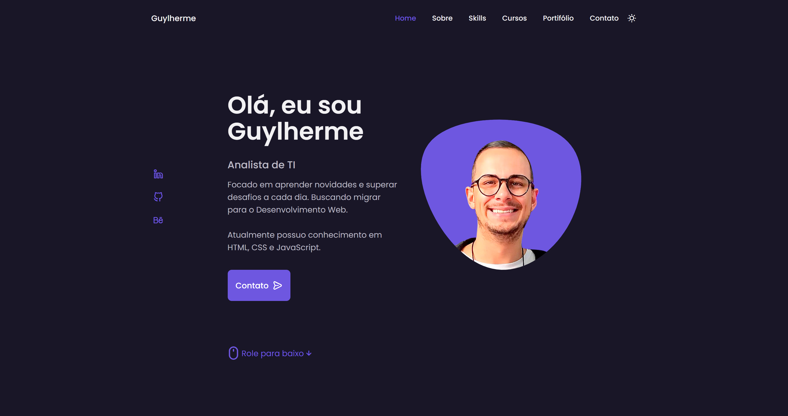

# Site de Portifólio Responsivo

Site de portfólio pessoal responsivo usando HTML, CSS e JavaScript. Rolagem suave em cada seção, incluindo um modo claro e escuro. Desenvolvido com a metodologia Mobile First. Compatível com todos os dispositivos móveis, com uma interface de usuário bonita e agradável. Utilizadas Unicons e Swiperjs.

## 🖼️ Preview



[🔗 Clique aqui para acessar](https://guylhermed.github.io/portifolio/)

## 🚀 Começando

Essas instruções permitirão que você obtenha uma cópia do projeto em operação na sua máquina local para fins de desenvolvimento e teste.

<!-- Consulte **[Implantação](#-implanta%C3%A7%C3%A3o)** para saber como implantar o projeto. -->

### 📋 Pré-requisitos

Possuir instalado em sua IDE o plugin `Live Server` ou semelhante, para poder rodar o servidor de desenvolvimento.

### 🔧 Instalação

 Primeiramente clone o projeto para sua máquina.
 
 Caso tenha instalado em sua IDE o plugin `Code Runner`, poderá rodar o servidor de desenvolvimento com o atalho:

```
Ctrl + Alt + N
```


## 🛠️ Construído com

* [Swiperjs](https://swiperjs.com/) - Mobile Touch Slider
* [Unicons](https://iconscout.com/unicons) - Coleção de Ícones

## ✒️ Autores

* **Guylherme Neves Duarte** - [@guylhermed](https://github.com/guylhermed)

## ✉️ Contato

* **Email** - guylherme_duarte@hotmail.com
